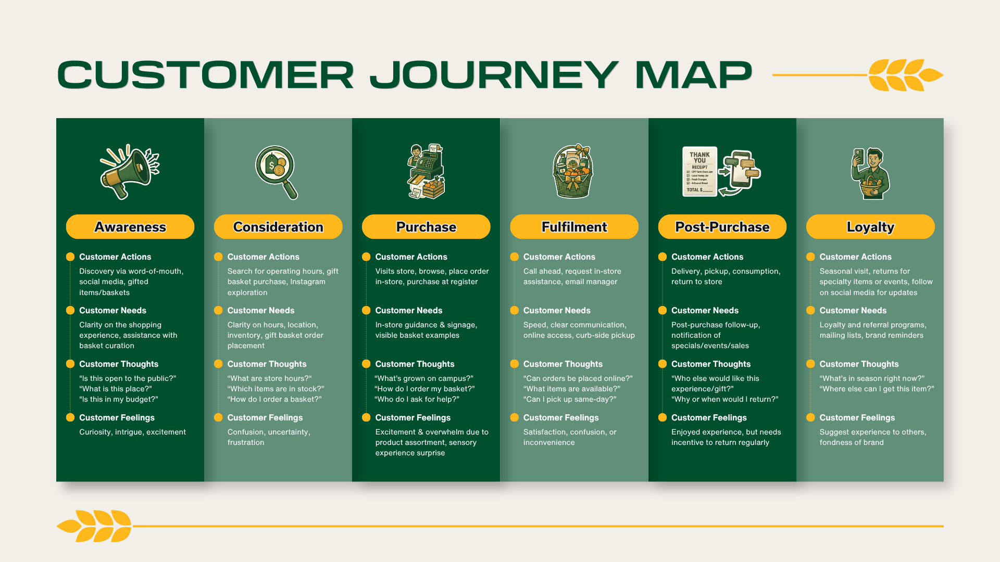

```{=html}
<style>
.title-logo {
  display: flex;
  align-items: center;
  justify-content: center;
  gap: 16px;
}

.title-logo img {
  height: 70px;
}

.title-logo h1,
.title-logo h2,
.title-logo p {
  margin: 0;
}
</style>
```

::: title-logo
# CPP Farmstore - Omnichannel Journey Map
:::

------------------------------------------------------------------------

## Target Customer Segment

Lorem ipsum

## Journey Stages

::: {.customer .journey .map}
{fig-align="center"}
:::

## Customer Actions

Lorem ipsum

## Customer Thoughts or Needs

Lorem ipsum

## Customer Touchpoints

Lorem ipsum

## Customer Painpoints

Lorem ipsum

## Omnichannel Opportunities

Lorem ipsum

## Strategic Implications for the Rest of the Project

Lorem ipsum

## Appendix

Lorem ipsum
